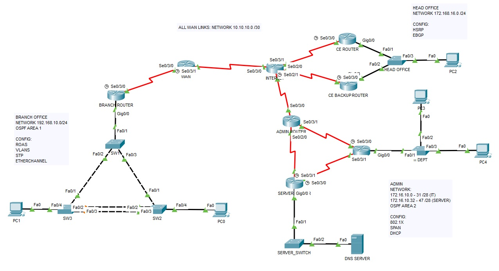

# Cisco CCNA
Packet tracer lab I built whilst gaining my Cisco CCNA Certification.

### Protocols Used:
* IPV4 & 6
* RIP
* Single area & mutliarea OSPF
* EBGP
* VLANS
* Inter-Vlan Routing
* DHCP
* Spanning Tree
* Etherchannels
* HSRP
* 802.1X
* SPAN
* Standard & Extended ACL
* Telnet & SSH

## Packet Tracer Lab:

